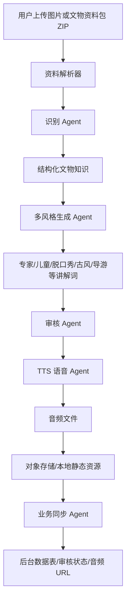

# 系统流程图

```mermaid
flowchart TD
    A[用户上传图片或文物资料包 ZIP] --> B[资料解析器]
    B --> C[识别 Agent]
    C --> D[结构化文物知识]
    D --> E[多风格生成 Agent]
    E --> F[专家/儿童/脱口秀/古风/导游等讲解词]
    F --> G[审核 Agent]
    G --> H[TTS 语音 Agent]
    H --> I[音频文件]
    I --> J[对象存储/本地静态资源]
    J --> K[业务同步 Agent]
    K --> L[后台数据表/审核状态/音频 URL]
```
